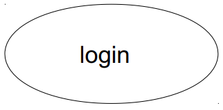
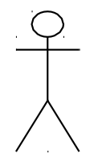
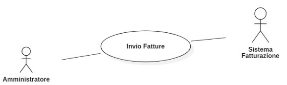
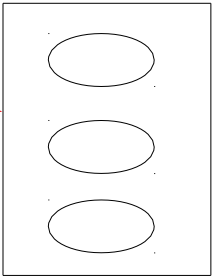
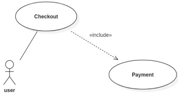
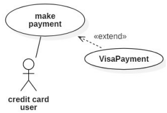
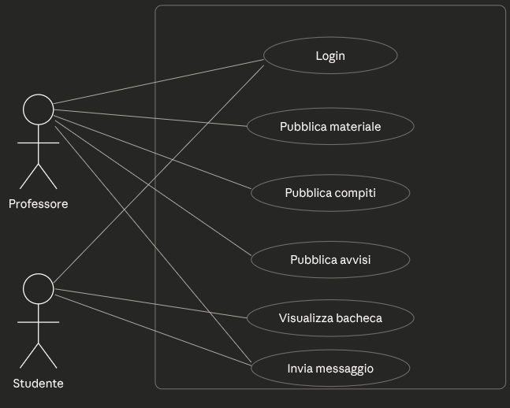
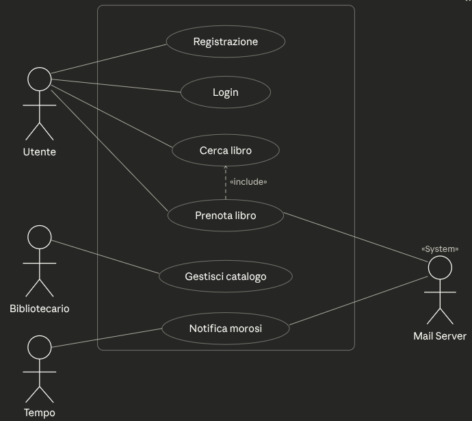
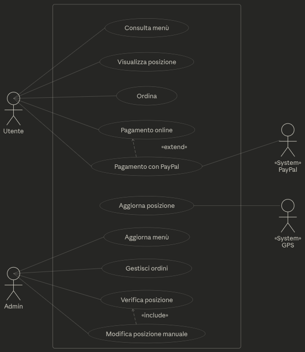

# Esercitazione su requisiti e Casi d’Uso

<!-- New section -->

## Sommario

I **casi d'uso** (_use case_) rappresentano uno strumento di supporto nella
fase di identificazione dei **requisiti funzionali** di un sistema

- Si basano sulla descrizione delle interazioni tipiche tra il sistema stesso, e utenti o sistemi esterni (**attori**)

- Un caso d’uso rappresenta il **valore** che deve essere dato all’utente

- aiuta a comprendere il funzionamento del sistema e ne mette in evidenza eventuali carenze

<!-- New subsection -->

Un **caso d'uso** ha

- _nome_ 

- _descrizione_ (spesso informale) della sequenza di eventi che avvengono tra gli oggetti durante l'elaborazione (anche degli attori esterni al sistema).

Possono contenere diagrammi esplicativi, ed altre informazioni che iutano l’interazione con il cliente

Includono uno o più **scenari**

<!-- New subsection -->

## Scenario

_sequenza dei passi_ che caratterizzano una particolare interazione tra uno o più attori e il sistema

- Viene usato nella raccolta dei requisti per l'elicitazione (identificazione, analisi, valutazione), la validazione e la documentazione dei requisiti

- Scritto in linguaggio naturale (terminologia del cliente)

Un insieme completo di scenari descrive tutto ciò che il sistema deve fare

<!-- New subsection -->

## Passi da seguire per la descrizione di un **caso d'uso**:

- Individuare lo **scenario principale**, esso caratterizza un andamento previsto/desiderato
- Descriverlo utilizzando una **sequenza di passi numerati**
- Individuare gli **scenari alternativi** che comprendono gli andamenti imprevisti e talvolta errati rispetto allo scenario principale
- Individuare gli **attori primari e secondari** ricordando che: ogni caso d'uso ha un **attore principale**

<!-- New section -->

## Diagramma dei casi d'uso

Fornisce un'istantanea dei casi d'uso e degli attori che caratterizzano il sistema in oggetto

- Individua **chi** o che cosa ha a che fare con il sistema (**attore**) e **che cosa** viene fatto (**caso d'uso**)
- Rappresenta la soluzione grafica UML per rappresentare i casi d'uso
- Il caso d'uso è rappresentato da un **ovale** con all'interno un "nome" significativo che ricorda la funzionalità rappresentata, per esempio `login`, `logout`...

<!-- New subsection -->

### Attore

Chiunque o qualsiasi _sistema esterno_ che interagisce con il sistema è un **attore** del sistema

- In caso di utenti, è un ruolo interpretato da un utente in relazione al sistema

- Graficamente è rappresentato da uno **stickman**

<!-- New subsection -->

- **Attori primari**: fanno partire il caso d'uso e ne sono i "beneficiari"

- **Attori secondari**: sono coinvolti nel caso d'uso, fornendo informazioni e/o ricevendone dal sistema
Ogni caso d'uso deve avere **uno** e **un solo** attore primario

Un **attore** può essere **primario** in alcuni casi d'uso e **secondario** in altri

<!-- New subsection -->

## Confini del sistema

- Identificare il confine del sistema significa comprendere cosa è **parte del sistema** (sta dentro i confini) e cosa **no** (sta fuori dai confini)

- Il confine del sistema viene rappresentato con un **rettangolo** che racchiude i Casi d'uso

<!-- New subsection -->

Le domande che è necessario porsi prima di disegnare il diagramma sono:

- Chi **usa** il sistema?
- Chi **fa partire** il sistema?
- Chi **amministra** il sistema?
- Chi fa lo **shut-down** del sistema?
- Quali altri sistemi **usano** il sistema?
- Chi **raccoglie** informazioni dal sistema?
- Chi **fornisce** informazioni al sistema?

<!-- New section -->

## Relazioni tra casi d'uso

### `<<include>>`

Si usa quando casi d'uso diversi hanno in comune una sequenza di passi da svolgere

- Si evidenziano **parti comuni**

- Si tratta di una **dipendenza** tra casi d'uso: il caso incluso fa parte del comportamento di quello che lo include

- Si evitano le **ripetizioni** nelle descrizioni dei casi d'uso

<!-- New subsection -->

Notazione: relazione di dipendenza (freccia tratteggiata) con stereotipo `<<include>>`

> Nell'**include** la freccia va dal caso d'uso che include **verso** quello incluso.

<!-- New subsection -->

### `<<extend>>`

Si usa quando un caso d'uso riassume scenari diversi con uno scenario principale e alcune possibili varianti che avvengono solo sotto particolari condizioni

- Si tratta di una **dipendenza** tra casi d'uso: il caso d'uso che estende specifica un incremento di comportamento a quello esteso

- Si tratta di comportamento **supplementare ed opzionale** che gestisce una variazione rispetto al comportamento normale

<!-- New subsection -->

Notazione: relazione di dipendenza (freccia tratteggiata) con stereotipo `<<extend>>`

> Nell'**extend** la freccia va dal caso d'uso che estende **verso** quello esteso.

<!-- New section -->

## Esercizio 1

Si supponga di dover sviluppare un'applicazione web per la gestione della bacheca scolastica.

- Al sistema accedono due tipi di utenti tramite _login_. Le credenziali sono fornite dalla scuola, quindi gli utenti non hanno bisogno di registrarsi.

<!-- .element: class="fragment" -->

- Un **professore** può _pubblicare il materiale_ delle lezioni, i _compiti_ assegnati e gli _avvisi_ relativi agli esami. Può inoltre _inviare messaggi_ agli **studenti**. 

<!-- .element: class="fragment" -->

- Uno **studente** può _visualizzare_ tutto il contenuto pubblicato sulla bacheca e _inviare messaggi_ al **professore**.

<!-- .element: class="fragment" -->

<!-- New subsection -->

- Disegnare il diagramma dei casi d'uso.
- Documentare il caso d'uso "**Pubblica compiti**".

<!-- New subsection -->

<!-- New subsection -->

## CdU "Pubblica compiti"

**Descrizione**

Il professore pubblica sulla bacheca i compiti assegnati agli studenti, indicando la descrizione e la data di consegna.
<!-- .element: class="fragment" -->

**Attori primari**

Professore
<!-- .element: class="fragment" -->

**Attori secondari**

nessuno
<!-- .element: class="fragment" -->

**Precondizioni**

il professore deve aver effettuato il login.
<!-- .element: class="fragment" -->

<!-- New subsection -->

**Sequenza principale**:

1. Il professore seleziona "Pubblica compiti" dalla bacheca.
<!-- .element: class="fragment" -->

2. Il sistema mostra il form di inserimento con i campi: descrizione del compito e data di consegna.
<!-- .element: class="fragment" -->

3. Il professore compila i campi e conferma la pubblicazione.
<!-- .element: class="fragment" -->

4. Il sistema valida i dati inseriti.
<!-- .element: class="fragment" -->

5. Il sistema pubblica il compito sulla bacheca e lo rende visibile a tutti gli studenti.
<!-- .element: class="fragment" -->

6. Il sistema mostra un messaggio di conferma al professore.
<!-- .element: class="fragment" -->

<!-- New subsection -->

**Postcondizioni** : il compito è visibile sulla bacheca di tutti gli studenti del corso.

<!-- New subsection -->

**Sequenza alternativa**:

- 3.A Annullamento dell'operazione:

  - 3.A.1 Il professore chiude il form o seleziona "Annulla" prima di confermare.
  <!-- .element: class="fragment" -->

  - 3.A.2 Il sistema scarta i dati inseriti senza effettuare alcuna pubblicazione. 
  <!-- .element: class="fragment" -->

**Postcondizioni**: il compito non viene pubblicato nella bacheca.
<!-- .element: class="fragment" -->

<!-- New subsection -->

**Sequenza alternativa**:

- 4.A Dati mancanti o non validi:

  - 4.A.1 Il sistema rileva che uno o più campi obbligatori sono vuoti oppure che la data di consegna è nel passato.
  <!-- .element: class="fragment" -->

  - 4.A.2 Il sistema evidenzia i campi errati e mostra un messaggio di errore descrittivo.
  <!-- .element: class="fragment" -->

  - 4.A.3 Il professore corregge i dati e ripete dal passo 3.
  <!-- .element: class="fragment" --> 

**Postcondizioni** : il compito è visibile sulla bacheca di tutti gli studenti del corso.
<!-- .element: class="fragment" -->

<!-- New subsection -->

**Sequenza alternativa**:

- 5.A Errore interno durante la pubblicazione:

  - 5.A.1 Il sistema non riesce a salvare il compito a causa di un errore (es. database non raggiungibile, timeout di rete).
  <!-- .element: class="fragment" -->

  - 5.A.2 Il sistema mostra un messaggio di errore e invita il professore a riprovare.
  <!-- .element: class="fragment" -->

  - 5.A.3 Il professore può riprovare dal passo 3 oppure annullare l'operazione.
  <!-- .element: class="fragment" -->

**Postcondizioni** : il compito non viene pubblicato nella bacheca.
<!-- .element: class="fragment" -->

<!-- New section -->

## Esercizio 2

Si supponga di dover sviluppare un sistema software per la gestione di una biblioteca pubblica. 

- Il sistema permette a un **utente** di _registrarsi_ fornendo nome, cognome, codice fiscale ed email, ed effettuare il _login_. 

<!-- .element: class="fragment" -->

- Una volta autenticato, l'**utente** può _cercare un libro_. Può anche _prenotare un libro_ disponibile e ricevere un riscontro tramite un sistema di posta elettronica esterno (**Mail Server**).

<!-- .element: class="fragment" -->

<!-- New subsection -->

- Il **bibliotecario** gestisce il catalogo (aggiunta, modifica e rimozione di libri).

<!-- .element: class="fragment" -->

- Nel caso di libri restituiti in ritardo, il sistema invia automaticamente una notifica via email all'utente moroso tramite un sistema di posta elettronica esterno (**Mail Server**).

<!-- .element: class="fragment" -->

<!-- New subsection -->

- Disegnare il diagramma dei casi d'uso.
- Documentare il caso d'uso "Prenota libro".

<!-- New subsection -->

<!-- New subsection -->

## CdU "Prenota libro"

**Descrizione**

L'utente cerca un libro disponibile e lo prenota per il ritiro in biblioteca.
<!-- .element: class="fragment" -->

**Attori primari**

Utente
<!-- .element: class="fragment" -->

**Attori secondari**

Mail Server
<!-- .element: class="fragment" -->

**Precondizioni**

l'utente deve aver effettuato il login; il libro cercato deve essere disponibile
<!-- .element: class="fragment" -->

<!-- New subsection -->

**Sequenza principale**:

1. L'utente seleziona l'opzione "Cerca libro" e inserisce i criteri (titolo, autore o ISBN)
<!-- .element: class="fragment" -->

2. Il sistema mostra la lista dei risultati corrispondenti, con titolo, autore, anno e disponibilità per ciascun libro.
<!-- .element: class="fragment" -->

3. L'utente seleziona il libro desiderato dalla lista.
<!-- .element: class="fragment" -->

4. Il sistema verifica la disponibilità e mostra i dettagli del libro
<!-- .element: class="fragment" -->

5. L'utente seleziona "Prenota"
<!-- .element: class="fragment" -->

6. Il sistema verifica che l'utente non abbia già una prenotazione attiva per lo stesso libro.
<!-- .element: class="fragment" -->

<!-- New subsection -->

7. Il sistema registra la prenotazione, associandola all'account dell'utente e alla copia disponibile.
<!-- .element: class="fragment" -->

8. Il sistema manda una notifica via mail tramite il **Mail Server** indicando il codice di prenotazione e la data entro cui il libro deve essere ritirato.
<!-- .element: class="fragment" -->

<!-- New subsection -->

**Postcondizioni** : la prenotazione è registrata nel sistema; la copia è riservata all'utente fino alla data di scadenza

<!-- New subsection -->

**Sequenza alternativa**:

- 4.A Nessun risultato trovato:

  - 4.A.1 Il sistema non trova libri corrispondenti ai criteri inseriti.
  <!-- .element: class="fragment" -->

  - 4.A.2 Il sistema mostra un messaggio di assenza di risultati e suggerisce di modificare i criteri di ricerca.
  <!-- .element: class="fragment" -->

  - 4.A.3 L'utente può inserire nuovi criteri e tornare al passo 1, oppure abbandonare la ricerca.
  <!-- .element: class="fragment" -->

**Postcondizioni** : nessuna prenotazione effettuata.
<!-- .element: class="fragment" -->

<!-- New subsection -->

**Sequenza alternativa**:

- 5.A Il libro risulta non disponibile (tutte le copie sono in prestito):

  - 5.A.1 Il sistema informa l'utente che non vi sono copie disponibili.
  <!-- .element: class="fragment" -->

  - 5.A.2 Il sistema propone all'utente di inserirsi in una lista d'attesa.
  <!-- .element: class="fragment" -->

  - 5.A.3 L'utente accetta, il sistema registra l'iscrizione alla lista d'attesa e si impegna a notificarlo non appena una copia si libera. Il caso d'uso termina.
  <!-- .element: class="fragment" -->

<!-- New subsection -->

**Postcondizioni** : nessuna prenotazione effettuata, l'utente è registrato in lista d'attesa.

<!-- New section -->

## Esercizio 3

Si vuole realizzare un sistema software per il tracciamento di un caddozzone itinerante. 

- L' **utente** può _consultare il menù_ del food truck, _visualizzare la sua posizione_ attuale sulla mappa, _effettuare un ordine_ e _pagarlo online_. Il pagamento online può essere effettuato anche tramite PayPal.

<!-- .element: class="fragment" -->

- Un **rilevatore GPS** _aggiorna automaticamente la posizione_ del camion ogni minuto.

<!-- .element: class="fragment" -->

- Un **amministratore**, tramite un pannello di controllo dedicato, è in grado di: _aggiornare il menù_; _gestire gli ordini_; _verificare che la posizione_ mostrata agli utenti sia corretta e _modificarla manualmente_ in caso di malfunzionamento del GPS.

<!-- .element: class="fragment" -->

<!-- New subsection -->

- Disegnare il diagramma dei casi d'uso.
- Documentare il caso d'uso "Ordina e paga".

<!-- New subsection -->

<!-- New subsection -->

## CdU "Ordina e paga"

**Descrizione**

L'utente consulta il menù, effettua un ordine, paga online e segue la posizione del camion per sapere dove ritirare il proprio ordine.
<!-- .element: class="fragment" -->

**Attori primari**

Utente
<!-- .element: class="fragment" -->

**Attori secondari**

PayPal (solo nella sequenza alternativa)
<!-- .element: class="fragment" -->

**Precondizioni**

il food truck deve trovarsi nella posizione indicata
<!-- .element: class="fragment" -->

<!-- New subsection -->

**Sequenza principale**:

1. L'utente seleziona "Consulta menù" e visualizza i prodotti disponibili
<!-- .element: class="fragment" -->

2. L'utente seleziona i prodotti desiderati e conferma l'ordine
<!-- .element: class="fragment" -->

3. Il sistema mostra il riepilogo dell'ordine e il totale da pagare
<!-- .element: class="fragment" -->

4. L'utente seleziona "Pagamento online" e inserisce i dati della carta di credito
<!-- .element: class="fragment" -->

5. Il sistema verifica i dati e addebita l'importo
<!-- .element: class="fragment" -->

<!-- New subsection -->

6. Il sistema conferma l'avvenuto pagamento e registra l'ordine
<!-- .element: class="fragment" -->

7. L'utente seleziona "Visualizza posizione" e visualizza sulla mappa la posizione attuale del camion per poter ritirare l'ordine
<!-- .element: class="fragment" -->

<!-- New subsection -->

**Postcondizioni**: l'ordine è registrato nel sistema e il pagamento è stato completato; 

<!-- New subsection -->

**Sequenza alternativa**:

- 4.A L'utente seleziona "Pagamento con PayPal" invece del pagamento con carta di credito:

  - 4.A.1 Il sistema reindirizza l'utente alla piattaforma PayPal, passando l'importo totale dell'ordine.
  <!-- .element: class="fragment" -->

  - 4.A.2 L'utente si autentica su PayPal e visualizza il riepilogo del pagamento.
  <!-- .element: class="fragment" -->

  - 4.A.3 L'utente autorizza il pagamento su PayPal.
  <!-- .element: class="fragment" -->

  - 4.A.4 PayPal elabora la transazione e comunica al sistema l'esito.
  <!-- .element: class="fragment" -->

<!-- New subsection -->

**Postcondizioni**: l'ordine è registrato nel sistema e il pagamento è stato completato; 

<!-- New subsection -->

**Sequenza alternativa**:

- 5.A Carta di credito rifiutata:

  - 5.A.1 Il sistema riceve un esito negativo dalla verifica della carta (dati errati, carta scaduta o fondi insufficienti).
  <!-- .element: class="fragment" -->

  - 5.A.2 Il sistema informa l'utente del motivo del rifiuto e propone di riprovare con una carta diversa o di passare al pagamento PayPal.
  <!-- .element: class="fragment" -->

  - 5.A.3 Se l'utente non completa il pagamento entro un tempo limite, il sistema annulla l'ordine.
  <!-- .element: class="fragment" -->

<!-- New subsection -->

**Postcondizioni**: nessun ordine registrato; nessun addebito effettuato.

