# Esercitazione sui diagrammi UML

<!-- New section -->

## Sommario

Nella lezione 2 abbiamo visto i diagrammi dei **requisiti** e dei **casi d'uso**. In questa
esercitazione affrontiamo quattro diagrammi UML che descrivono il sistema da
**punti di vista diversi**:

- **Diagramma di attività** indica il _flusso_ del programma (anche in parallelo)
- **Diagramma di sequenza** mostra le _interazioni_ tra oggetti nel tempo
- **Diagramma di stato** modella il _ciclo di vita_ di un singolo oggetto
- **Diagramma delle classi** rappresenta la _struttura statica_ del sistema

<!-- New section -->

## Diagramma di Attività

I diagrammi di attività sono usati per descrivere:

- **Workflow**
- **Logica procedurale**

Vengono spesso adoperati:

- in **analisi**, per descrivere gli scenari di un caso d'uso
- in **progettazione**, per descrivere metodi complessi

<!-- New subsection -->

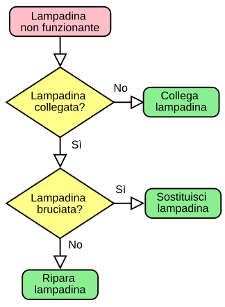

Sono molto simili ai _diagrammi di flusso_, ma supportano la rappresentazione
di **elaborazione parallela**.

<!-- New subsection -->

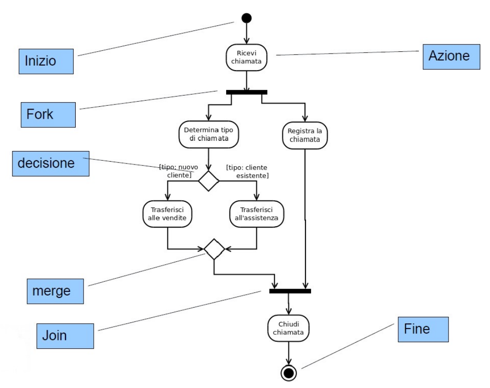

> Esempio diagramma delle attività

<!-- New subsection -->

### Notazione

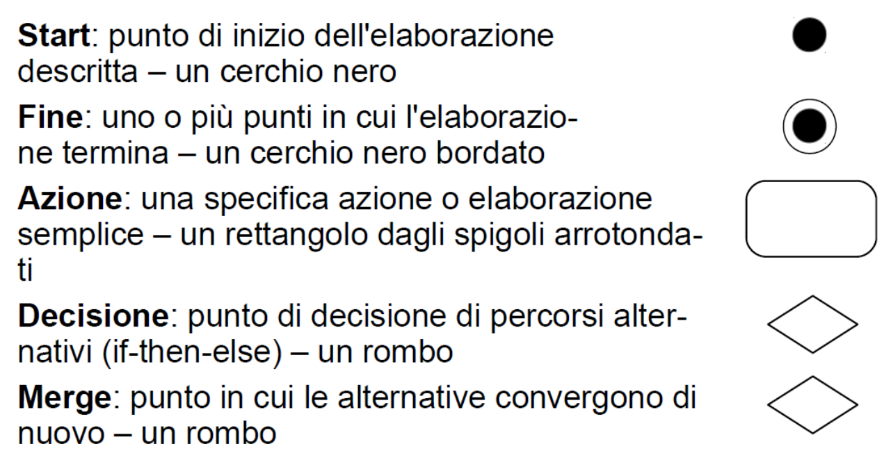

<!-- New subsection -->

### Semantica dei token

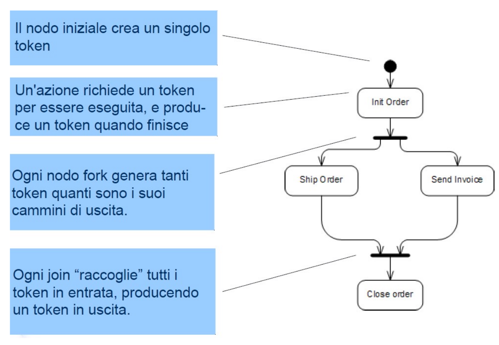

<!-- New subsection -->

### Esercizio 1

Si modelli con un diagramma di attività il processo di prelievo di contante da uno sportello ATM. Il cliente inserisce la carta e digita il PIN. Il sistema verifica il PIN: se è errato, l'operazione viene annullata e la carta restituita; se è corretto, il cliente inserisce l'importo. A questo punto il sistema, in parallelo, eroga il contante e prepara la ricevuta; solo quando entrambe le attività sono concluse il sistema restituisce la carta e termina.

<!-- New subsection -->

### Soluzione Esercizio 1

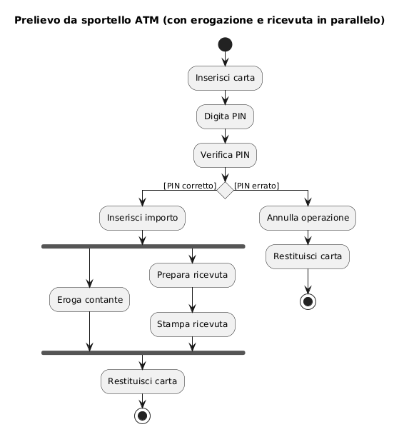

<!-- New subsection -->

### Esercizio 2

Uno studio di geometra deve preparare e far approvare il progetto di una villetta per un cliente.

- Dopo un colloquio in cui ottiene i requisiti dal cliente, esso deve preliminarmente ottenere i dati catastali del terreno su cui costruire, e i dati del Piano Regolatore comunale.
- Una volta reperite tali informazioni, lo studio crea il progetto e lo invia all'Ufficio Edilizia Privata (UEP) del comune.
- L'UEP esamina il progetto e, se riscontra errori formali, lo respinge perché venga corretto e reinviato all'UEP dallo studio del geometra.

<!-- New subsection -->

### Esercizio 2

- Se il progetto è formalmente corretto, l'UEP lo invia alla Provincia per il parere di impatto ambientale, e alle Belle Arti per il parere relativo ai beni culturali. Contemporaneamente, lo esamina per accertarne la correttezza rispetto alle leggi e al Piano Regolatore.
- Quando tale esame è concluso, e i pareri sono arrivati, passa la pratica alla Commissione Edilizia.
- Questa, in base ai pareri dell'UEP, Provincia e Belle Arti, approva o respinge il progetto.

<!-- New subsection -->

### Esercizio 2

- Se lo respinge, l'iter termina con una notifica di non approvazione al proponente.
- Se lo approva, la pratica passa all'Ufficio Finanze per calcolare gli oneri di urbanizzazione e le tasse, e poi notifica l'approvazione e l'importo da pagare al proponente.
<!-- New subsection -->

### Soluzione Esercizio 2

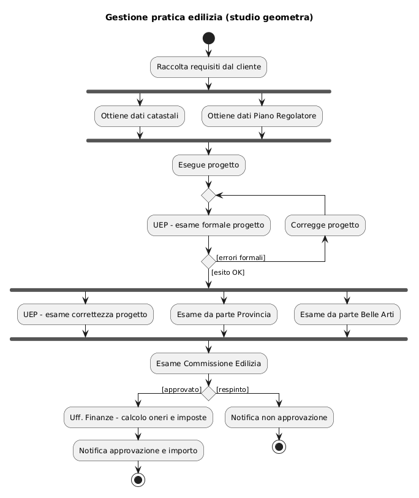

<!-- New subsection -->

### Esercizio 3

Modellare con un diagramma di attività il “workfow” di un processo penale per evasione fiscale che avviene secondo i seguenti passi:

- Si inizia con una segnalazione di reato che attiva le prime indagini
- Se il procuratore ritiene che ci sia la verosimiglianza del reato iniziano le indagini vere e proprie altrimenti si archivia. In caso di indagini:
  - si invia l'avvio di garanzia all'indagato
  - la Guardia di Finanza esegue ispezione e perquisizione; i PC e supporti elettronici trovato sono inviati a un perito per l'analisi
  - si eseguono controlli delle operazioni bancarie
  - si richiedono visure delle attività estere

<!-- New subsection -->

### Esercizio 3

- Quando tutte tali indagini sono completate il procuratore stila una relazione e il caso è portato al Giudice delle indagini preliminari 
- Il Giudice può decidere il non luogo a procedere oppure il rinvio a giudizio
- In caso di rinvio a giudizio il caso è assegnato a una Corte e si datempo sia al Procuratore che alla Difesa per approfondire le indagini
- Finiti gli approfondimenti inizia il processo penale
- Alla conclusione del processo ci può essere un'assoluzione o una condanna.

<!-- New subsection -->

### Soluzione Esercizio 3

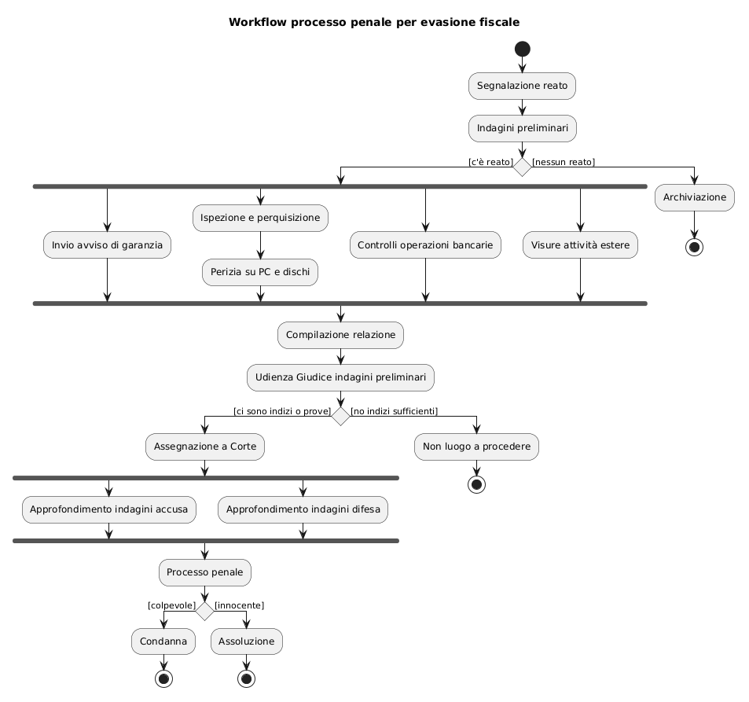

<!-- New section -->

## Diagramma di Sequenza

I diagrammi di sequenza **illustrano come gli oggetti interagiscono tra loro**.

Sono usati per descrivere il **comportamento** di un insieme di oggetti, ad esempio all'interno di un **singolo caso d'uso**

<!-- New subsection -->

### Partecipanti e messaggi

- Il diagramma include un certo numero di **partecipanti** e i **messaggi**
  scambiati tra essi durante l'esecuzione dello scenario
- Un diagramma di sequenza inizia con un **partecipante esterno** che invia un
  messaggio a un altro partecipante, iniziando un'elaborazione

<!-- New subsection -->

### Creazione e distruzione dei partecipanti

- La **creazione** è un messaggio che punta direttamente al box del partecipante creato
- Se il nuovo partecipante fa qualcosa subito dopo la creazione, si può disegnare
  la **barra di attivazione** direttamente attaccata al box
- La **distruzione** è indicata con una grossa **X** sulla _lifetime_ del partecipante

<!-- New subsection -->

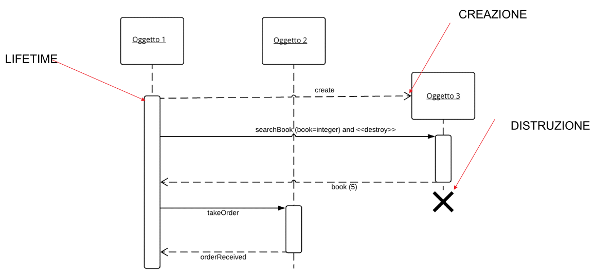

<!-- New subsection -->

### Tipi di messaggio

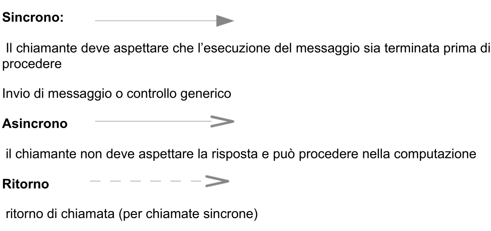

<!-- New subsection -->

### Frame di interazione

La notazione prevede l'utilizzo di rettangoli che racchiudono una regione del
diagramma, detti **frame di interazione**. Ogni frame ha un **operatore**:

- **loop** per i cicli
- **alt** per `if/then/else`
- **opt** per l'esecuzione opzionale

Ogni frame può avere una **guardia** rappresentata tra parentesi quadre.

<!-- New subsection -->

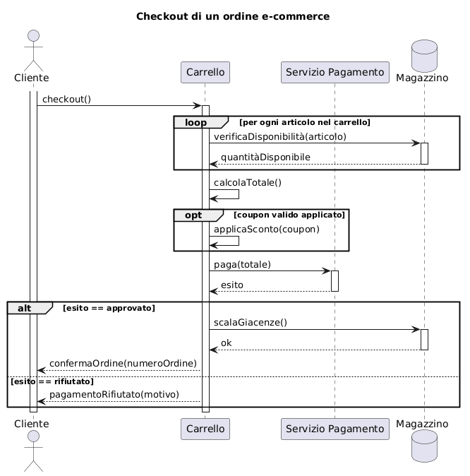

> Esempio di diagramma di sequenza: loop, alt, opt con guardia

<!-- New subsection -->

### Esercizio 1
Si modelli con un diagramma di sequenza lo scenario in cui un cliente paga un acquisto con carta a un terminale POS. 

Il cliente avvicina la carta al terminale, che inoltra la richiesta di pagamento al circuito bancario; la banca verifica il saldo sul conto del cliente e autorizza la transazione. 

Il terminale stampa lo scontrino e mostra al cliente l'esito.

<!-- New subsection -->
### Soluzione Esercizio 1

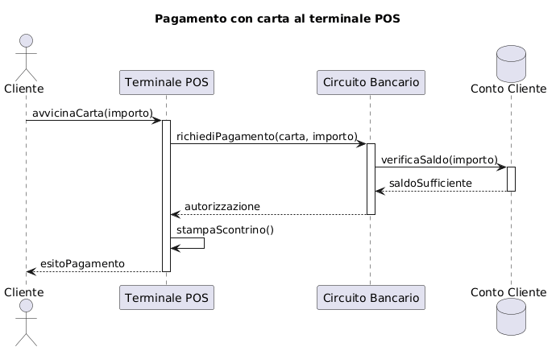

<!-- New subsection -->

### Esercizio 2

La società “AmiciAnimali” gestisce lo zoo della città. Tale società ha adottato un sistema software per il controllo dei dipendenti e degli ambienti nei quali vivono gli animali.

Un amministratore con funzioni particolari è il manager. Il manager può assumere o licenziare personale. Il manager alla fine del mese si collega al sistema e decide i turni di pulizia, cioè decide per ogni settimana del mese quali addetti alle pulizie debbano pulire
una determinata area dello zoo.

Talvolta può capitare che il manager deleghi un amministratore affinché espleti l'assegnamento dei turni di pulizia.

<!-- New subsection -->

### Esercizio 2

Il sistema comunica ad ogni addetto alle pulizie quale area del parco gli è assegnata per ogni settimana del mese. 

Ogni addetto alle pulizie può essere assegnato ad una sola
area del parco.

Modellare tramite diagramma di sequenza l’assegnamento dei turni agli addetti delle pulizie 
<!-- New subsection -->
### Soluzione Esercizio 2

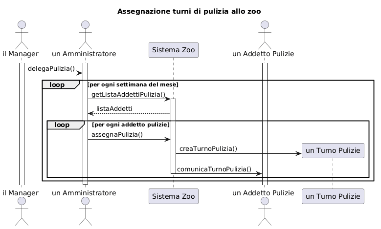

<!-- New subsection -->

### Esercizio 3

Supponiamo di dover progettare un sistema software per la gestione di prestiti di libri per una biblioteca.

Lo scenario di richiesta prestito che si vuole modellare è il seguente:

- se il libro è disponibile il sistema effettua il controllo sul numero dei prestiti già erogati per l'utente.
- se il numero massimo di prestiti è stato raggiunto allora non è possibile prendere in prestito il libro.
- in caso contrario il prestito viene concesso e il sistema aggiorna la lista dei libri in prestito.

<!-- New subsection -->

### Esercizio 3

Il responsabile dell'erogazione del prestito è il Gestore prestiti che sostanzialmente rappresenta l'interfaccia tra l'utente e il resto del sistema. Sarà dunque suo compito verificare se il libro è disponibile o meno, concedere il prestito, e fare gli opportuni
aggiornamenti.

Modellare tramite diagramma di sequenza lo scenario di richiesta prestito

<!-- New subsection -->

### Soluzione Esercizio 3

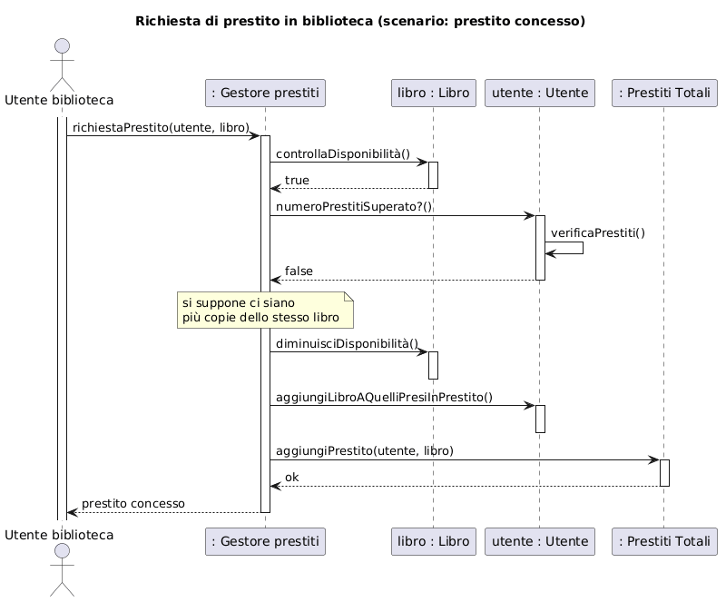

<!-- New subsection -->

### Esercizio 4

Prima della partenza da ogni porto, il responsabile passeggeri di una nave crociera, che è un utente abilitato del sistema, con nome e password,
interroga il sistema per verificare che tutti i passeggeri abbiano fatto rientro.

Se l'ospite non ha fatto rientro, la nave parte comunque e l'ospite sarà identificato dal sistema come assente.

Modellare lo scambio di messaggi tra le entità e il sistema al fine di conoscere il numero di ospiti che risultano assenti in un dato istante.

<!-- New subsection -->

### Soluzione Esercizio 4

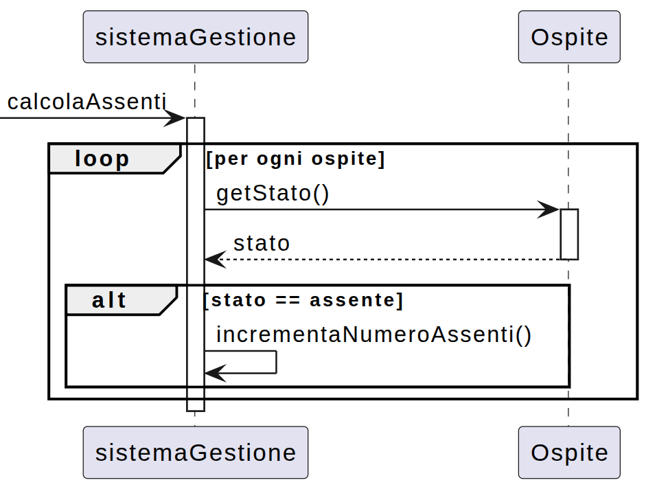

<!-- New section -->

## Diagramma di Stato

I diagrammi di stato descrivono il **comportamento di un'entità** come
**variazione del suo stato interno** quando è sottoposta a sollecitazioni dal
mondo esterno.

> Entità = sistema software, sistema hardware, oggetto istanza di una classe OO, entità del mondo reale.

<!-- New subsection -->

Il diagramma mostra il comportamento di un oggetto per la durata del suo
**ciclo di vita**. 

È caratterizzato da:

- i possibili **stati** di un oggetto
- gli **eventi** che provocano una transizione da uno stato all'altro
- le **azioni** risultanti da un cambiamento di stato

Sono usati per gli oggetti con un **comportamento dinamico significativo**.

<!-- New subsection -->

### Che cos'è uno stato

Lo **stato** è una condizione nella quale un oggetto può trovarsi durante il suo
ciclo di vita

- In senso generale, lo stato è dato dal valore degli **attributi** e delle **associazioni** dell'oggetto
- In molti domini applicativi, esistono oggetti che, a seconda del proprio stato, rispondono in maniera diversa ai messaggi ricevuti.
- Lo stato può essere **semplice** oppure **composto** (_composite_)

<!-- New subsection -->
Uno **stato** rappresenta una situazione (nella vita di un oggetto) durante la quale delle condizioni vengono soddisfatte e delle attività possono essere
eseguite

> Esempio: un velivolo può trovarsi nei seguenti 5 stati: On, Of, TakingOf, Landing, Flying

<!-- New subsection -->

> ATTENZIONE: Quando gli sviluppatori parlano di **stato**, spesso intendono una o più combinazioni di valori di tutti i campi di un oggetto. Gli stati di un diagramma sono qualcosa di più **astratto**: ad ognuno di essi corrisponde un diverso **comportamento** del sistema al verificarsi degli eventi

<!-- New subsection -->

### Notazione

Graficamente i diagrammi di stato sono rappresentati da un **grafo** (nodi e
archi): il **nodo** è lo stato, l'**arco** rappresenta transizioni, eventi,
guardie e attività.

- **Stato iniziale**: marca l'inizio, non  è un vero e proprio stato ma punta allo stato iniziale. **Unico** per ogni diagramma di stato (o stato composito)

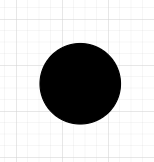

<!-- New subsection -->
- **Stato**: un rettangolo con il nome dello stato

  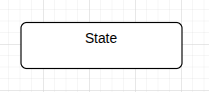

- **Transizione**: il passaggio da uno stato all'altro; se esce da uno stato e vi ritorna è detta **auto-transizione** (auto-anello)

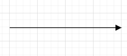

<!-- New subsection -->

- **Stato finale**: indica il completamento dell'esecuzione; in uno stesso diagramma possono esserci **più** stati finali

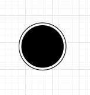

<!-- New subsection -->

### Transizioni

Ogni transizione può specificare:

- **Evento**: un _trigger_ che attiva il passaggio di stato (qualcosa che l'oggetto **subisce**)
- **Guardia**: una condizione che, se vera, permette il passaggio di stato
- **Attività**: una o più **azioni** compiute prima di cambiare stato (qualcosa che l'oggetto **esegue**)

<!-- New subsection -->

Un **evento** è qualcosa che un oggetto subisce,come ad esempio la ricezione di un messaggio

Un' **azione** è qualcosa che l’oggetto esegue, come l’invio di un messaggio o l’esecuzione di un’operazione

Notazione:

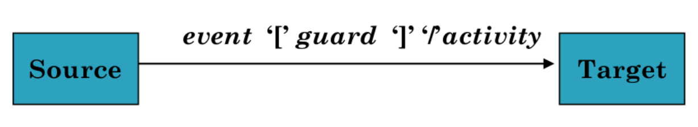

<!-- New subsection -->

Eventi, guardie e attività sono **tutti opzionali**:

- se manca l'**attività**, durante la transizione si cambia stato ma non si fa altro
- se manca la **guardia**, la transizione è intrapresa ogni volta che si verifica l'evento
- se manca l'**evento**, la transizione avviene immediatamente

<!-- New subsection -->

### Stati composti

Gli **stati composti** sono stati che possono essere espansi in **sottostati**:
in questo caso il rettangolo che lo rappresenta contiene un **sotto-diagramma** di stato.

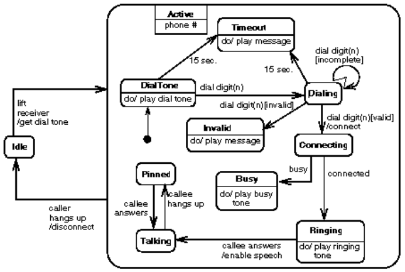

<!-- New subsection -->

### Esercizio 1

Si modelli con un diagramma di stato il ciclo di vita di un ordine in un negozio online. Un ordine appena creato è "in attesa di pagamento". 

Quando si riceve il pagamento, se l'importo è corretto l'ordine passa "in preparazione" e il sistema invia una email di conferma; se l'importo non è corretto, l'ordine resta in attesa. 

Una volta preparato, viene spedito e si trova "in transito". 

Alla consegna, l'ordine è "consegnato". 

In qualsiasi momento prima della spedizione, l'ordine può essere annullato: in tal caso il sistema emette un rimborso.

<!-- New subsection -->

### Soluzione Esercizio 1

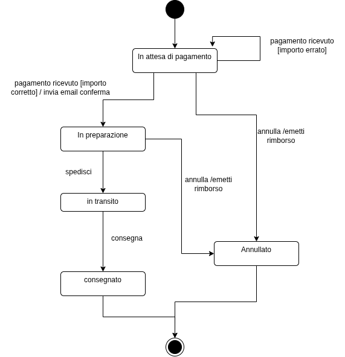

<!-- New subsection -->

### Esercizio 2

Un sottomarino diesel/elettrico ha vari modi di funzionamento: inizialmente è fermo in superficie a motore spento. Può accendere il motore diesel e deve eventualmente partire. 

Finché resta in superficie procede esclusivamente col motore diesel. In immersione, può procedere col motore diesel se la sua
profondità non supera i 20m, ma anche col motore elettrico. Sotto i 20m può procedere solo col motore elettrico. 

Se le batterie scendono sotto una certa carica, è obbligato a risalire a meno di 20m e a far partire il motore diesel.

Descrivere i passaggi di stato del sottomarino tramite un diagramma di stato UML.

<!-- New subsection -->

### Soluzione Esercizio 2

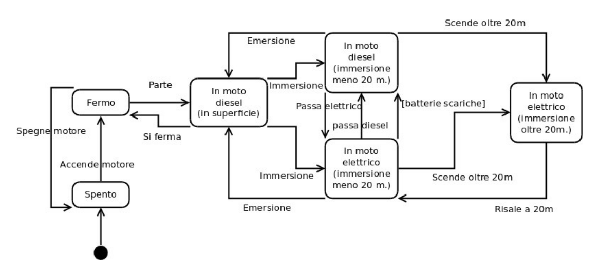

<!-- New subsection -->

### Esercizio 3

In un sistema di gestione bug, la vita di un bug inizia con una segnalazione, che pone il bug in una situazione di “Aperto”. Esso viene poi esaminato,
e vi sono tre possibili situazioni:

- il bug è già stato segnalato: viene marcato come “Duplicato” e l'elaborazione termina;
- segnalazione corretta, il bug è inviato a un responsabile per l'approvazione;
- occorrono altre informazioni, che sono richieste: quando arrivano, il bug è inviato per l'approvazione.
- il responsabile può approvare la lavorazione del bug o cancellarlo; se lo approva, esso deve essere assegnato a un programmatore.

<!-- New subsection -->

### Esercizio 3

- Una volta assegnato, il programmatore può metterlo in lavorazione, e anche sospendere e poi riprendere la stessa.
- Una volta terminata la lavorazione, il bug va ai “tester” per la verifica. Se tale verifica è superata, esso è marcato come “Completato” e l'elaborazione termina; altrimenti, è rimesso in assegnazione allo stesso o a un altro programmatore.

Disegnare un diagramma UML di stato che descriva i possibili stati di un Bug nel sistema, e le loro transizioni

<!-- New subsection -->

### Soluzione Esercizio 3

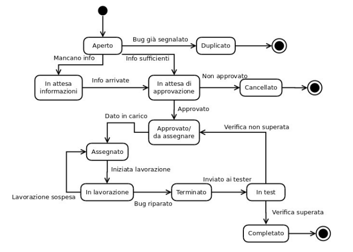

<!-- New section -->

## Diagramma delle Classi

Il diagramma delle classi è il principale diagramma UML per descrivere il **tipo di oggetti** che fanno parte del sistema e le **relazioni statiche** tra di essi

- È utilizzabile per **generare il codice** (strutture dati e dichiarazioni delle funzioni)
- È il diagramma UML più usato in fase di **analisi e progetto** di sistemi OO
- Mostra le classi e le loro relazioni a un livello di **astrazione alto**

<!-- New subsection -->

### Tre livelli d'uso

- **Analisi**: descrive classi e relazioni senza suggerire come implementare il sistema (nome, operazioni e relazioni principali)
- **Design**: descrive come il sistema sarà implementato (si specificano attributi e comportamento delle operazioni)
- **Implementazione**: molto dettagliato (specifiche dei metodi); si può generare automaticamente lo "scheletro" del software

<!-- New subsection -->

### La classe

Una **classe** descrive un insieme di oggetti che condividono gli stessi
attributi, operazioni, metodi, relazioni e semantica.

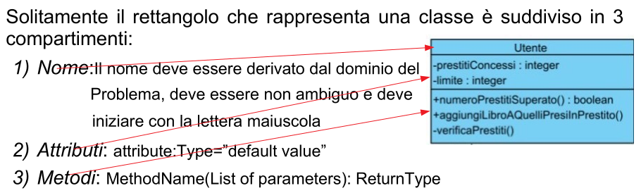

> È possibile personalizzare numero e tipo di compartimenti specificando il nome di ogni compartimento.

<!-- New subsection -->

### Le relazioni

Il diagramma consiste di classi e di **relazioni** tra coppie di classi. Le
relazioni possono avere associati un nome, dei ruoli, la **molteplicità** e dei
vincoli.

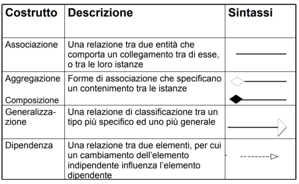

<!-- New subsection -->

### Aggregazione e composizione

Sono due **forme particolari di associazione** che esprimono un rapporto
**tutto-parte**: una classe (il _tutto_) è composta da istanze di un'altra
(le _parti_).

Si distinguono per la **forza del legame**, cioè per cosa succede alle parti
quando il tutto viene distrutto.

<!-- New subsection -->

### Aggregazione: legame debole

Il tutto _raggruppa_ le parti, ma le parti **esistono indipendentemente**: se
il tutto viene distrutto, le parti sopravvivono.

- Notazione: **rombo vuoto** sul lato del tutto
- Esempio: un **Dipartimento** raggruppa **Impiegati**, ma un impiegato continua
  a esistere anche se il dipartimento viene chiuso (verrà riassegnato)

<!-- New subsection -->

### Composizione: legame forte

Il tutto **possiede** le parti e ne governa il **ciclo di vita**: se il tutto
viene distrutto, le parti **vengono distrutte con esso**. Una parte appartiene
a **un solo** tutto alla volta.

- Notazione: **rombo pieno** sul lato del tutto
- Esempio: un **B&B** è composto da **Camere**: le camere non hanno senso
  senza il B&B a cui appartengono; se il B&B chiude, le sue camere cessano di esistere

<!-- New subsection -->

### Come scegliere?

La domanda da porsi è: **la parte può vivere senza il tutto?**

| | Aggregazione | Composizione |
|---|---|---|
| Legame | debole | forte |
| Ciclo di vita | indipendente | condiviso col tutto |
| La parte può stare in più "tutti" | sì | no |
| Rombo | vuoto ◇ | pieno ◆ |

> Nel dubbio, si usa l'**associazione** semplice: aggregazione e composizione
> vanno usate solo quando il rapporto tutto-parte è significativo.

<!-- New subsection -->

### Molteplicità

La **molteplicità** indica *quante* istanze di una classe possono essere
collegate a un'istanza dell'altra. Si scrive **a ciascun estremo**
dell'associazione e si legge "attraversando" la linea.

| Notazione | Significato                |
|-----------|----------------------------|
| `1`       | esattamente uno            |
| `0..1`    | zero o uno (opzionale)     |
| `*` o `0..*` | zero o più (nessun limite) |
| `1..*`    | uno o più (almeno uno)     |
| `2..4`    | intervallo specifico       |

<!-- New subsection -->

Per leggerla si fissa un'istanza di un estremo e ci si chiede *con quante*
istanze dell'altro estremo è in relazione:

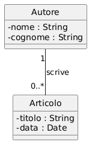

- Un **Autore** scrive **`0..*`** Articoli → appena registrato può non averne ancora scritto nessuno
<!-- .element: class="fragment" -->

- Un **Articolo** è scritto da **`1`** Autore → ogni articolo ha sempre ed esattamente un autore
<!-- .element: class="fragment" -->

<!-- New subsection -->

### Come costruire un diagramma delle classi

Domande da porsi prima di disegnare: 

- Quali informazioni sono necessarie alla classe?
- Come comunicheranno le classi tra loro? 
- Quali attributi e metodi deve avere ciascuna classe?

<!-- New subsection -->

I passi:

- Leggere attentamente il testo
- Identificare i **sostantivi** che possono rappresentare una **classe** (sottolineare i sostantivi e considerare i più significativi). I nomi delle classi vanno al **singolare** e con l'**iniziale maiuscola** (per nomi composti, maiuscola anche la seconda iniziale, es. `ProgettoRicerca`)
- Identificare le **azioni** compiute da ogni classe (i **metodi** / responsabilità)
- Identificare come le classi sono **collegate** e comunicano tra loro (le **relazioni**)

<!-- New subsection -->

Alcune euristiche utili:

- Se un concetto ha una struttura semplice e non ha informazioni rilevanti associate, probabilmente è un **attributo** di una classe (non una classe a sé)
- I legami logici tra concetti diventano **associazioni**, a cui assegnare un nome significativo
- Se uno o più concetti sono **casi particolari** di un altro concetto, conviene rappresentarli con una **generalizzazione**

<!-- New subsection -->

### Esercizio 1

Un’azienda è costituita da uno o più dipartimenti, ad ognuno dei quali afferisce un certo insieme di impiegati. Ogni impiegato (del quale interessa nome e cognome) afferisce esattamente ad un dipartimento. Dei dipartimenti interessa il nome, il numero di telefono, la data di afferenza di ognuno degli impiegati che vi lavorano, ed il direttore. Il direttore è un impiegato e può dirigere solo un dipartimento. Gli impiegati partecipano a vari progetti aziendali, dei quali interessa il nome ed il budget.

<!-- New subsection -->

Completare il seguente diagramma delle classi (aggiungere attributi, operazioni,associazioni,ruoli e molteplicità) considerando la descrizione data.

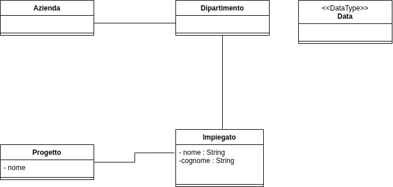

<!-- New subsection -->

Una classe Azienda è composta (possiede una lista, collezione etc…) di dipartimenti la relazione che lega queste classi è l’**aggregazione**

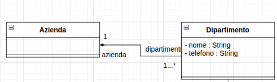

<!-- New subsection -->

Mediante relazione di aggregazione si mostra che un Dipartimento può avere una collezione di impiegati.

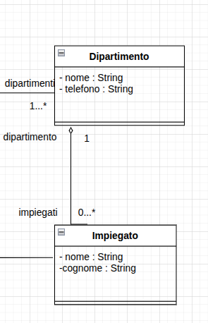

<!-- New subsection -->

Viene aggiunta la classe Afferenza come attributo della classe Impiegato (tramite la relazione di associazione) un Impiegato può avere una o più afferenze come indicato dalla molteplicità. 

Un Dipartimento può avere 0 o più impiegati ma può avere un solo Direttore (che è un impiegato)

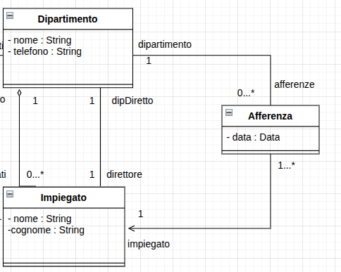

<!-- New subsection -->
La classe Data, di tipo Datatype ha la funzione di memorizzare le date relative all’afferenza non appare nessun collegamento perché è un attributo della classe afferenza di tipo Data.

Si può notare la presenza dell’etichetta relativa allo stereotipo in cui le istanze sono valori, in questo caso date.

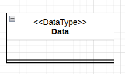

<!-- New subsection -->

### Soluzione Esercizio 1

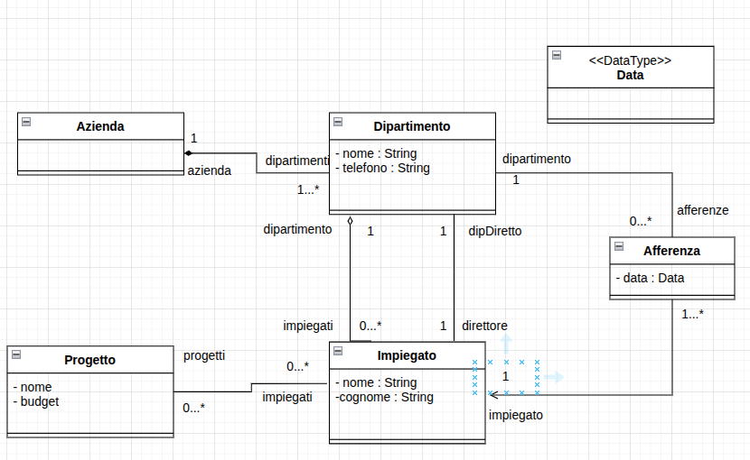

<!-- New subsection -->

### Esercizio 2

Dati i seguenti requisiti di un sistema software si modelli la seguente applicazione software, per la gestione di un B&B.

Un B&B ha un indirizzo, telefono, mail, mappa per arrivare. Ha anche un dato numero di camere, ciascuna con un nome, delle foto, il numero di posti letto, l'info se ha bagno o doccia, il prezzo per giorno e per settimana.

Al sistema accedono utenti, con nome e password

Il proprietario effettua la configurazione del B&B e gestisce il sistema stampando rendiconti, e eventualmente “bannando” clienti scorretti. 

<!-- New subsection -->

### Esercizio 2

I clienti devono dare anche nome e cognome, doc. di identità (tipo, nr., emissione e data scadenza), indirizzo, telefono, mail, Codice Fiscale.

Un cliente può interrogare il sistema, per ottenere la disponibilità e il prezzo delle camere in un dato periodo. Egli può prenotare una o più camere, per un dato periodo, se disponibili. Per farlo, deve dare i dati della carta di credito, che il sistema passa alla banca collegata, che autorizza il pagamento. Il cliente può disdire una prenotazione, pagando un giorno di soggiorno.

Il sistema registra l'arrivo del cliente e la sua partenza.

<!-- New subsection -->

### Soluzione Esercizio 2

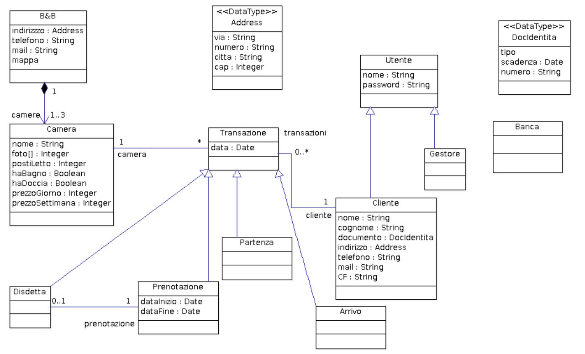

<!-- New subsection -->

### Esercizio 3

Si vuole progettare un sistema che gestisca il noleggio di diverse tipologie di natanti (gommoni, moto d’acqua, canoe, laser). 

La società possiede i mezzi e i clienti possono noleggiarli.

I gommoni sono caratterizzati da numero identificativo, modello, numero posti, disponibilità, tipologia di patente necessaria alla guida; le moto d’acqua hanno numero identificativo, modello, disponibilità, tipologia di patente necessaria alla guida; le canoe possiedono numero identificativo, numero posti, disponibilità; i laser hanno numero identificativo e disponibilità.

<!-- New subsection -->

### Esercizio 3

L’utente non registrato puo navigare il catalogo e visualizzare le diverse offerte. Per prenotare il noleggio di uno dei mezzi deve registrarsi e loggarsi al sistema. Per registrarsi al sistema l’utente deve fornire nome, cognome, username e password.

Quando l’utente ha individuato l’offerta più conveniente può scegliere se registrarsi e proseguire con il noleggio.Un utente registrato, dopo aver effettuato il login e dopo aver selezionato l’imbarcazione, può procedere direttamente al noleggio.

Il noleggio può essere effettuato fornendo nome, cognome, tipo e numero di documento, patente. L’utente può, a questo punto, può selezionare il metodo di pagamento desiderato.

<!-- New subsection -->

### Esercizio 3

Il pagamento infatti può essere effettuato tramite carta di credito o in contanti alla consegna dell’imbarcazione. Per le imbarcazioni a motore è previsto un costo aggiuntivo per il carburante calcolato in base al consumo effettivo che viene verificato all’atto della restituzione del mezzo.

Se dopo l’uso viene segnalato un malfunzionamento, l’imbarcazione viene ritirata ed inviata alla manutenzione. Solo dopo la riparazione del guasto il mezzo sarà di nuovo disponibile. Il sistema è sempre aggiornato con il numero di imbarcazioni e natanti disponibili.

<!-- New subsection -->

### Soluzione Esercizio 3

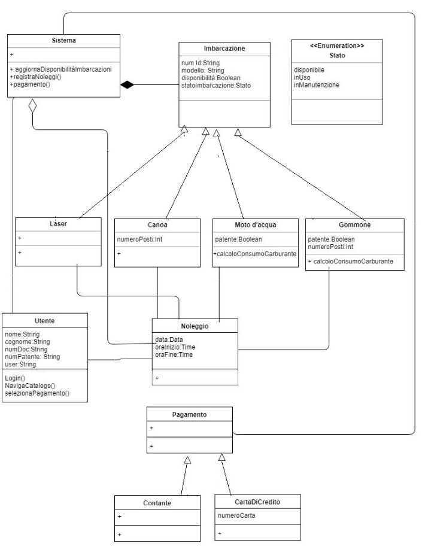